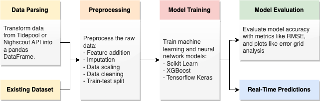

# Blood Glucose Prediction-Kit

This Blood Glucose (BG) Prediction Framework streamlines the process of data handling, training, and evaluating blood 
glucose prediction models in Python. Access all features via the integrated Command Line Interface (CLI).

The figure below illustrates an overview over the pipeline including all the stages of this blood glucose prediction 
framework.




## Table of Contents
1. [Setup and Installation](#setup-and-installation)
2. [Usage of Command Line Interface](#usage-of-command-line-interface)
   - [Parsing Data](#parsing-data)
   - [Preprocessing Data](#preprocessing-data)
   - [Train a Model](#train-a-model)
   - [Evaluate Models](#evaluate-models)
   - [Setting Configurations](#setting-configurations)
3. [Contributing with Code](#contributing-with-code)
   - [Adding Data Source Parsers](#adding-data-source-parsers)
   - [Adding Data Preprocessors](#adding-data-preprocessors)
   - [Adding Machine Learning Prediction Models](#adding-machine-learning-prediction-models)
   - [Implementing Custom Evaluation Metrics](#implementing-custom-evaluation-metrics)
   - [Adding Evaluation Plots](#adding-evaluation-plots)
4. [Error Metrics Overview](#error-metrics-overview)
5. [Disclaimers and Limitations](#disclaimers-and-limitations)

## Setup and Installation
1. **Virtual Environment Setup**:
   - Create a virtual environment:
     ```
     python -m venv bgp-evaluation
     ```
   - Activate the virtual environment:
     ```
     source bgp-evaluation/bin/activate
     ```

2. **Dependency Installation**:
   - Install the required packages:
     ```
     pip install -r requirements.txt
     ```

3. **Submodules Setup**:
   - Add the required submodules:
     ```
     git submodule update --init --recursive
     ```

4. **Initial Directory Setup**:
   - Ensure you have the following directory structure in place:
     - `data/`
       - `raw/`
       - `processed/`
       - `models/`
     - `results/`
       - `reports/`
       - `figures/`

Now, you're ready to use the Command Line Interface (CLI) for processing and predicting blood glucose levels.


## Usage of Command Line Interface

The `src/cli.py` script is a command-line tool designed to streamline the end-to-end process of data handling, preprocessing, model training, evaluation, and configuration for blood glucose prediction. The following is a guide to using this script.

Note that running the commands below is assuming that you have already performed the steps above in "Setup and Installation",
and that you are located in the root of this directory in the terminal. All calls to the CLI start with
```
python -m src.cli COMMAND
```


### Parsing Data
**Description**: Parse data from a chosen source and store it as CSV in `data/raw` using the selected parser. If you have an existing dataset, you should store it in `data/raw` before preprocessing.

```
python -m src.cli parse --parser [tidepool|nightscout] USERNAME PASSWORD [--file-name FILE_NAME] [--start-date START_DATE] [--end-date END_DATE]
```
- `--parser`: Choose a parser between `tidepool` and `nightscout`.
- `username`: Your username for the data source.
- `password`: Your password for the data source.
- `--file-name` (Optional): Provide a name for the output file.
- `--start-date` (Optional): Start date for data retrieval, default is two weeks ago.
- `--end-date` (Optional): End date for data retrieval, default is now.

#### Example

```
python -m src.cli parse --parser tidepool johndoe@example.com mypassword --file-name output.csv --start-date 2023-09-01 --end-date 2023-09-30
```

---

### Preprocessing Data
**Description**: Preprocess data from an input CSV file and store the training and test data into separate CSV files.

```
python -m src.cli preprocess INPUT_FILE_NAME [--preprocessor [scikit_learn|tf_keras]] [--prediction-horizon PREDICTION_HORIZON] [--num-lagged-features NUM_LAGGED_FEATURES] [--include-hour INCLUDE_HOUR] [--test-size TEST_SIZE] [--num_features NUM_FEATURES] [--cat_features CAT_FEATURES]
```
- `--preprocessor`: Choose between scikit_learn and tf_keras for preprocessing.
- `input-file-name`: Name of the input CSV file containing the data. Note that this file needs to be lodated in `data/raw`.
- `--prediction-horizon` (Optional): Prediction into the future given in time in minutes.
- `--num-lagged-features` (Optional): The number of samples to use as time-lagged features. CGM values are sampled in 5-minute intervals, so 12 samples equals one hour.
- `--include-hour` (Optional): Whether to include hour of day as a feature.
- `--test-size` (Optional): The fraction in float to how much of the data shall be used as test data.
- `--num_features` (Optional): List of numerical features, separated by comma. Note that the feature names must be identical to column names in the input file.
- `--cat_features` (Optional): List of categorical features, separated by comma. Note that the feature names must be identical to column names in the input file.

#### Example

```
python -m src.cli preprocess tidepool_16-09-2023_to_30-09-2023.csv --num_features CGM,insulin --cat_features hour
```


---

### Train a Model
**Description**: Train a model using the specified training data.
```
python -m src.cli train_model --model MODEL_NAME INPUT_FILE_NAME [--prediction-horizon PREDICTION_HORIZON]
```
- `--model`: Name of the model file (without .py) to be trained. The file name must exist in `src/models`.
- `input-file-name`: Name of the CSV file containing training data. The file name must exist in `data/processed`.
- `--prediction-horizon` (Optional): The prediction horizon for the target value in minutes.

#### Example
```
python -m src.cli train_model --model ridge train-data_scikit_learn_ph-60_lag-12.csv
```
---

### Evaluate Models
**Description**: Evaluate one or more trained models using the specified test data, compute metrics and generate plots. The results will be 
stored in `results/reports` for evaluation metrics and in `results/figures` for plots.

```
python -m src.cli evaluate_model --model-files MODEL_FILE_NAMES [--metrics METRICS] [--plots PLOTS] TEST_FILE_NAME [--prediction-horizon PREDICTION_HORIZON]
```
- `--model-files`: List of trained model filenames from `data/trained_models` (without .pkl), separated by comma.
- `--metrics` (Optional): List of metrics from `src/metrics` to be computed, separated by comma.
- `--plots` (Optional): List of plots from `src/plots` to be generated, separated by comma. 
- `test-file-name`: Name of the CSV file containing test data.

#### Example
```
python -m src.cli evaluate_model --model-files ridge_ph-60,arx_ph-60,svr_linear_ph-60 --metrics rmse
```

---
### Setting Configurations

```
python -m src.cli set_config --use-mgdl [True|False]
```
**Description**: Set whether to use mg/dL or mmol/L for units.

---

That's it! You can now run the desired command with the mentioned arguments. Always refer back to this guide for the correct usage.


## Contributing with code

TODO: Describe the file structure.

Definitions:
- **Parsing**: Refers to the fetching of data from data sources (for example Nighscout, Tidepool or Apple Health), and to process the data into the same table. The parsed datasets are stored in 'data/raw/'.
- **Preprocessing**: Refers to the preprocessing of the raw datasets from the parsing-stage. This includes imputation, feature addition, removing NaN values, splitting data etc. The preprocessed datasets are stored in 'data/preprocessed'.
- **Model training**: Refers to using preprocessed data to train a blood glucose prediction model. The trained models are stored in 'data/models/'.
- **Metrics**: Refers to different 'scores' to describing the accuracy of the predictions of a blood glucose prediction model. The evaluation metrics are stored in tables 'results/reports/'.
- **Plots**: Different types of plots that can illustrate blood glucose predictions together with actual measured values. The plotted results are stored in 'results/figures/'.


### Adding Data Source Parsers
Note: Parser must have class name Parser.

Note: add new file to the CLI alternatives.

Note: Clearly define requirements for data inputs.

### Adding Data Preprocessors
Note: targets from preprocessors will be named "target".

Note: Preprocessors must have class name Preprocessor

Note: add new file to the CLI alternatives.

### Adding Machine Learning Prediction Models
Note: targets from presossors will be named "target".

### Adding Evaluation Metrics
To implement your own BGP evaluation metric, create a new class that inherits from the BaseMetric class in `src/metrics/base_metric.py`. Your new class should implement the `__call__` method, which takes two lists of glucose values (the true values and the predicted values) as input and returns a single value representing the performance of the metric.


### Adding Evaluation Plots


### Testing
To run the tests, write `python tests/test_all.py` in the terminal.

## Error Metrics Overview

| Name                                            | Class     | Description                                                                                                                                                                                                                                                        |
|-------------------------------------------------|-----------|--------------------------------------------------------------------------------------------------------------------------------------------------------------------------------------------------------------------------------------------------------------------|
| Root Mean Squared Error                         | RMSE      | Returns a value between [0, inf]. Treats high and low values equally.                                                                                                                                                                                              | 
| Mean Absolute Error                             | MAE       | Returns a value between [0, inf]. Treats high and low values equally.                                                                                                                                                                                              | 
| Pearson's Correlation Coefficient               | PCC       | a measure of the linear relationship between two variables X and Y, giving a value between -1 and +1. A value of +1 indicates a perfect positive correlation, 0 indicates no correlation, and -1 indicates a perfect negative correlation.                         | 

## Disclaimers and limitations
* Datetimes that are fetched from Tidepool API are received converted to timezone offset +00:00. There is no way to get information about the original timezone offset from this data source.
* Bolus doses that are fetched from Tidepool API does not include the end date of the dose delivery.
* Metrics assumes mg/dL for the input.
* Note that the difference between how basal rates are registered. Bolus doses are however consistent across. Hopefully it is negligable.