# Plots

## All Metrics Table

```
glupredkit draw_plots --results-files ridge__my_config__180.csv,loop__my_config__180.csv,zero_order__my_config__180.csv --plots all_metrics_table --prediction-horizons 30
```

#### Description

A table showing the metric results for all of the implemented metrics and all of the given models, at a given prediction horizon. 

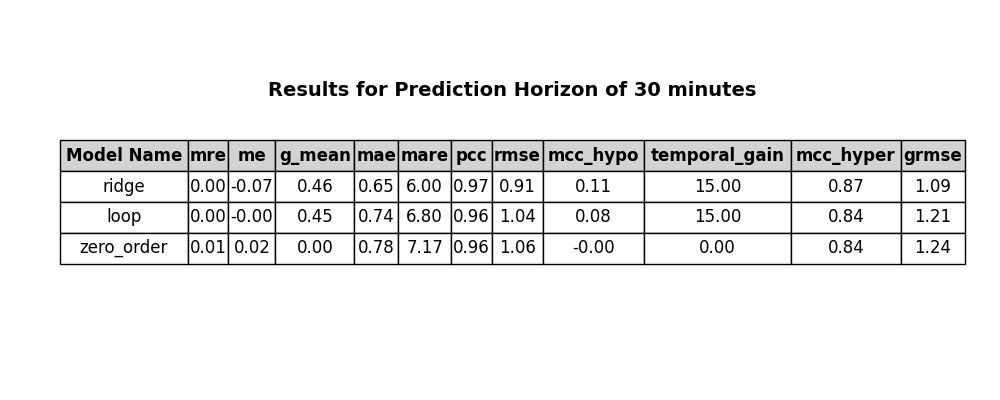


## Composite Glucose Prediction Metric (CGPM) Table

```
glupredkit draw_plots --results-files ridge__my_config__120.csv,naive_linear_regressor__my_config__120.csv,zero_order__my_config__120.csv --plots cgpm_table --prediction-horizons 30
```

#### Description

The CGPM is a composite metric consisting of RMSE, Temporal Gain, and Geometric Mean measuring the prediction of glycemic events (TO DO: Insert reference when paper available). The lower the CGPM, the better. The numbers in parenthesis are the scaled versions of the metrics, that are used to be summed together and form the CGPM metric.

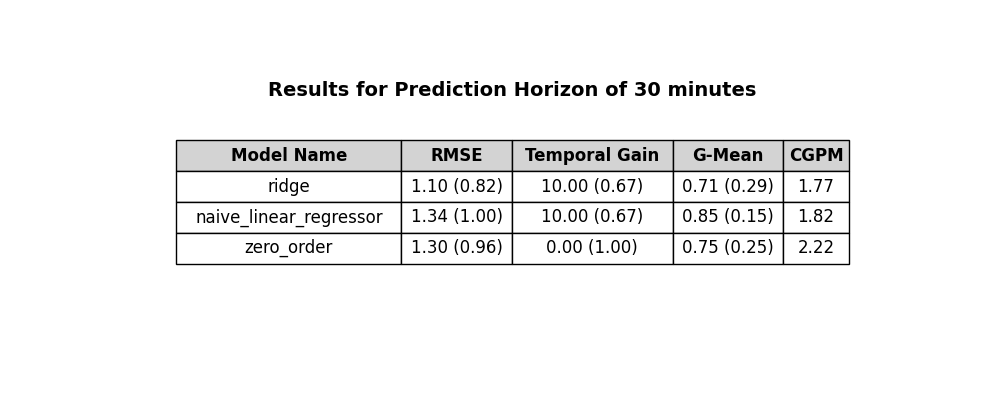


## Confusion Matrix

```
glupredkit draw_plots --results-files ridge__my_config__120.csv --plots confusion_matrix --prediction-horizons 30
```

#### Description

The confusion matrix separates glucose zones into hypoglycemia (<70 mg/dL), target range, and hyperglycemia (>180 mg/dL). Then, we turn it into a classification problem and compute the predictions vs measured values within each zone. Hence, the perfect result would be if the left diagonal had 100% in each cell. 

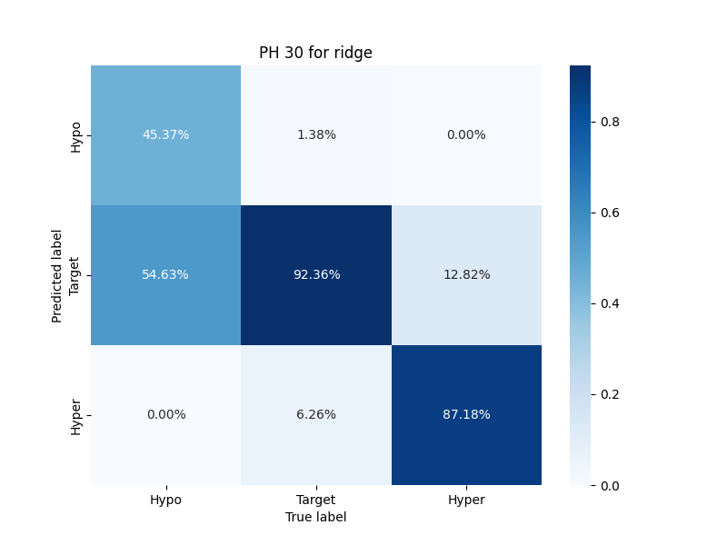


## Error Grid Plot

```
glupredkit draw_plots --results-files ridge__my_config__120.csv --plots error_grid_plot --prediction-horizons 30 --type parkes
```

#### Description

Parkes or Clarke error grid plot. Type input can be either `clarke` or `parkes`.

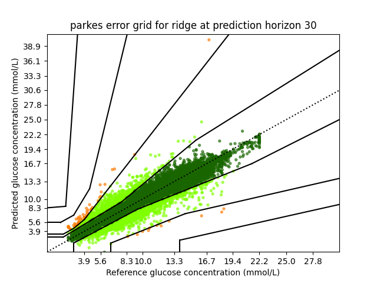

## Error Grid Table 

```
glupredkit draw_plots --results-files ridge__my_config__120.csv,naive_linear_regressor__my_config__120.csv,zero_order__my_config__120.csv --plots error_grid_table --prediction-horizons 30 --type clarke
```

#### Description

Parkes or Clarke error grid table, overview over the percentages of predictions within each zone. Type input can be either `clarke` or `parkes`. The weighted average adds a weight 1 to zone B, 2 to zone C... And computes the weighted average of the scores to condense the score into a single number, for ease of interpretation and comparison between algorithms.

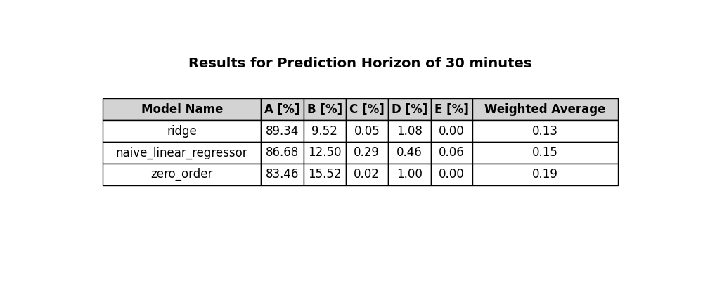


## Pareto Frontier 

```
glupredkit draw_plots --results-files ridge__my_config__120.csv,naive_linear_regressor__my_config__120.csv,zero_order__my_config__120.csv --plots pareto_frontier --prediction-horizons 30 
```

#### Description

Pareto Frontier Plot to show the trade-off between each metric. The red cross indicates the models that are in the Pareto Frontier, meaning that the models are not strictly dominated by another model for any metric (to do: add reference to paper when available). 

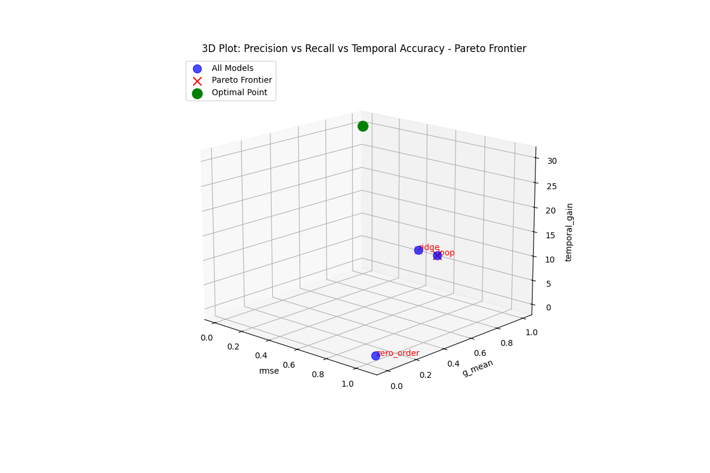


## Results Across Regions 

```
glupredkit draw_plots --results-files ridge__my_config__120.csv --plots results_across_regions --prediction-horizons 30 --metric rmse
```

#### Description

This plot shows different metrics when splitting the results into the different glycemic ranges of hypoglycemia, target range, and hyperglycemia. 

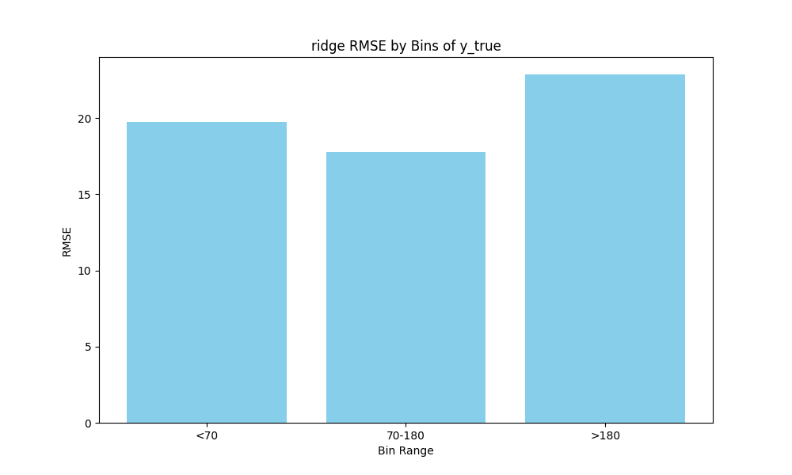


## Scatter Plot 

```
glupredkit draw_plots --results-files ridge__my_config__120.csv,naive_linear_regressor__my_config__120.csv,zero_order__my_config__120.csv --plots scatter_plot --prediction-horizons 30 
```

#### Description

Scatter plot of predicted and measured values.


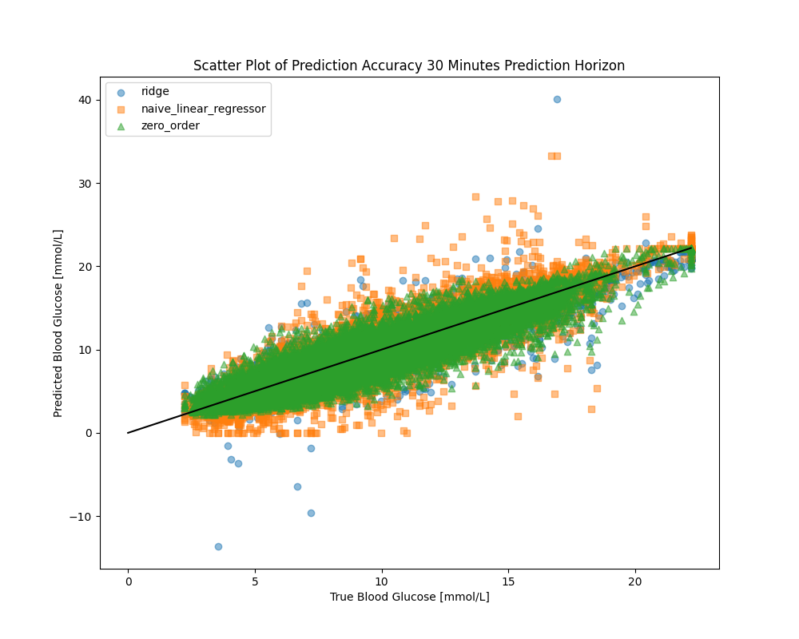


## Single Prediction Horizon 

```
glupredkit draw_plots --results-files ridge__my_config__120.csv --plots single_prediction_horizon --prediction-horizons 30 
```

#### Description

Plotting the measurements and the corresponding predictions for a period.


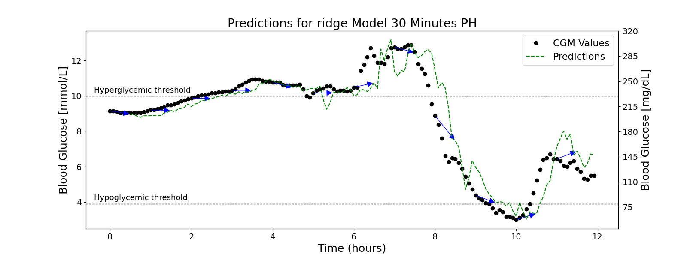


## Trajectories 

```
glupredkit draw_plots --results-files ridge__my_config__120.csv --plots trajectories
```

#### Description

Plotting the predicted trajectories for all of the prediction horizons included. 


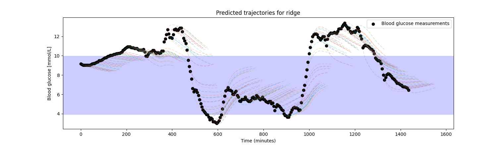


## Trajectories with Events

```
glupredkit draw_plots --results-files ridge__my_config__120.csv --plots trajectories_with_events
```

#### Description

Trajectories plot including the carbohydrate and insulin events.


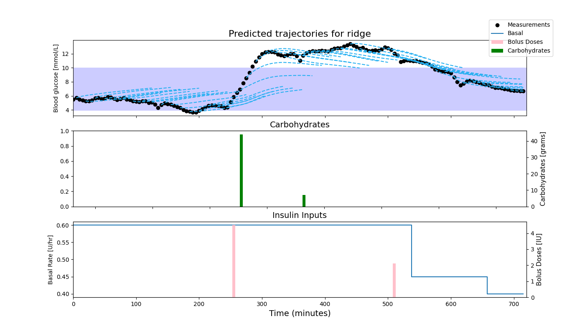


