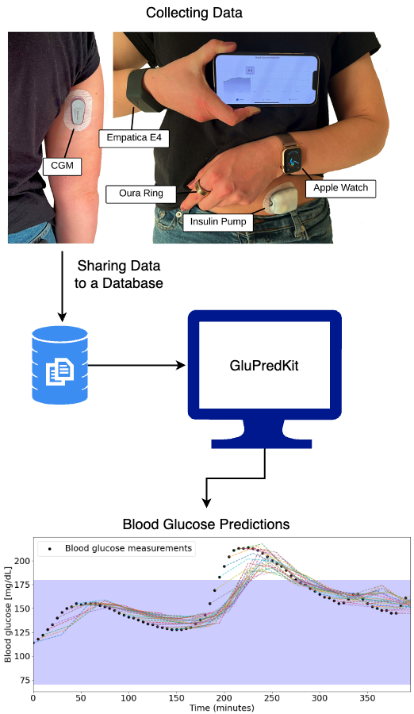

# Summary

Managing blood glucose levels is crucial for individuals with diabetes. Historically, non-linear physiological modelling of glucose dynamics laid the groundwork for automated insulin delivery. Blood glucose prediction can be used as decision support for patients or as a component in an automated insulin delivery control strategy. Today, machine learning and deep neural networks offer new pathways for improvement, and the literature is vast of proposed models. Yet, comparing these advanced models is challenging. Differences in the datasets used for testing and the ways in which results are evaluated can make comparisons from existing studies unreliable [@Jacobs2023]. Additionally, many research studies do not share their code, making it hard to build upon previous work. `GluPredKit` addresses these issues by standardizing the pipeline steps needed for any blood glucose prediction research (see \autoref{fig:flow}). This includes the collection, organization, and preparation of data, as well as the ability to easily compare different models and measure their effectiveness. Additionally, the software incorporates state-of-the-art components, including the ability to integrate and standardize data from various sources, utilize existing prediction models, and apply established evaluation metrics. It also features automated generation of detailed model evaluation reports, guided by the consensus on blood glucose model evaluation [@Jacobs:2023].

{ width=20% }

# Statement of need

GluPredKit is a Python package designed to streamline the process of blood glucose prediction, accessible via both a Command Line Interface (CLI) and as a library on PyPi. There is a need for standardized evaluation guidelines to leverage the potential of artificial intelligence in enhancing glycemic control for diabetes management [@Jacobs:2023]. Research indicates that modern deep learning models can provide superior predictions compared to traditional complex non-linear physiological models [@Cappon:2023].

GluPredKit addresses this need by automating the generation of evaluation reports for individual or multiple models in PDF format. Its modular design and standardized approaches facilitates community contributions, enabling researchers to integrate new models, metrics, or data sources while maintaining compatibility with existing components in a plug-and-play framework. The software includes state-of-the-art features such as integration with common data sources, ready-to-use white- and black-box models, and evaluation metrics. 

Despite the vast literature on proposed blood glucose prediction algorithms and benchmarking studies [@xie2020benchmarking][@meijner2017blood], many do not provide open-source code or are not designed for scalability and integration with other models or data sources. The GLYFE study represents the closest existing package to GluPredKit, as it benchmarks several models and shares its source code, allowing the addition of new components [@debois2022glyfe]. However, `GluPredKit` differs from GLYFE in being more flexible in accommodating different dataset input features and hypothetical scenarios, and on visualizations such as plots and predicted trajectories in addition to evaluation metric. Furthermore, `GluPredKit is designed not only as a standalone package but also as a dependency that can be integrated into other software systems, unlike GLYFE's GUI-centric approach.

To ensure broad usability and scalability, GluPredKit consolidates prominent work in the field into a single repository with a scalable architecture that supports future community contributions. Its usability has been validated through user tests [@Wolff2024]. Additionally, Oh et al. utilized the platform in a master’s thesis, incorporating existing models from the literature and validating them against reported results [@oh2024thesis]. Integrated test datasets include the Ohio dataset [@marling2020ohiot1dm], Tidepool API, and Nightscout API. The software implements physiological models based on Uva Padova, using implementations from ReplayBG [@cappon2023replaybg] and PyLoopKit, both of which are open-source, in contrast to proprietary models in commercial systems. Moreover, off-the-shelf models such as Ridge Regressor, Random Forest, and LSTM have been implemented. The complete and evolving list of components is documented in the GluPredKit documentation.

# `GluPredKit` Workflow

The `GluPredKit` workflow is typically through the Command Line Interface or use it as a dependency in external projects via PyPi. As illustrated in \autoref{fig:cli}, the first step involves parsing the input data to prepare it for processing. Users then configure the settings tailored to their specific needs before moving on to model training and testing phases. After testing, the user can generate a PDF report detailing the results or allow the user to process their own results independently. For a detailed visualization of these steps, refer to the figure provided in the documentation.

{ width=20% }

TO DO: UPDATE THE FIGURE FOR THE NEW VERSION OF GLUPREDKIT.

The software features a scalable, modular architecture designed to facilitate community contributions and serve as a hub for new advances. It consists of four key modules: data source parsers, preprocessors, prediction models, and evaluation metrics. Detailed instructions and standardized code interfaces are provided in the repository's documentation, enabling contributors to easily add and integrate their own modules.

# Acknowledgements

This project is supported by the Department of ICT and Natural Sciences at Norwegian University of Science and Technology. We acknowledge contributions from Rune Volden, Martin Steinert, Hans Georg Schaathun, and Anders Lyngvi Fougner during the genesis of this project. 

# References

